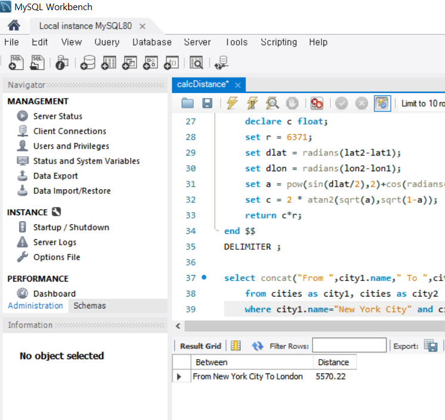

# Distbetweencities
Calculate distance in km between cities using their latitude and longitude using Mysql stored function.

- Haversine formula
- Doesn't account for the Earth being a spheroid
- [Reference](https://stackoverflow.com/questions/27928/calculate-distance-between-two-latitude-longitude-points-haversine-formula "Stack Overflow")

